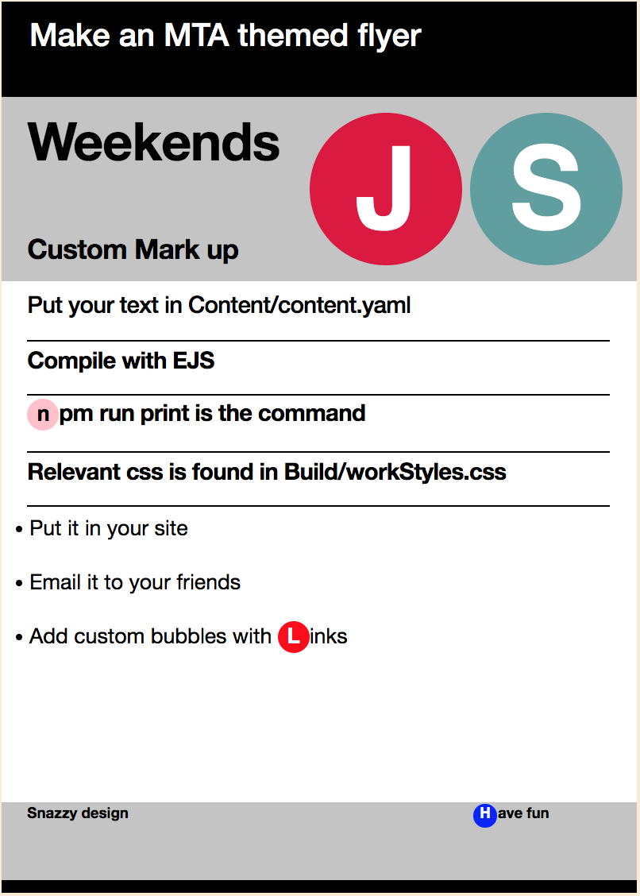

# MTA Flyer Template

Generate a fun MTA themed poster! Fill it out with your own content via yaml and build it on the command line. Powered by CSS and ejs templating.

```bash
clone this repo
npm install
npm run print
```

#### Command line arguments:
First positional argument: name of file of which to output into the `Build` folder. Defaults to `MTAFlyer.html`

--source, `-s`: filepath. Path of which to provide yaml content. Defaults to `Content/content.yaml`
##### Flags: 
--markup, `-m `: Use to generate html tags only without document head and style sheet. This is useful if you want to make multiple posters, or incorporate the markup into a larger document.

--dont-open,` -o` : Don't open a browser tab when ejs compilation finishes.

ex:

` npm run print -- myOutput.html -source myCustomPoster.yaml -m -o`




Source: `content.yaml`
```yaml
title: Make an MTA Themed Flyer
datesHeader: Weekends
subHeader: New York City
firstBubble: J
firstBubbleColor: crimson
secondBubble: S
secondBubbleColor: cadetblue
headerItems:
  - Add your own custom copy!
  - Put your text in "Content/content.yaml"
  - Compile with EJS
  - '{^n^pink^^black}pm run print is the command'
infoItems:
  - Put it in your site
  - Email it to your friends
  - Add custom bubbles with {^L^red^^white}inks
  - Relevant css is found in "Build/workStyles.css"
footerItems:
  - Snazzy design
  - ''
  - '{^H^blue^^white}ave fun'
  ```

#### Interpolating route bubbles 
Besides providing your own content, you can also add custom route bubbles into your flyer. The ejs functionality will parse bubble markup from strings. The notation for adding a bubble is this : 
`{^Letter^color(hex value)^href^color of letter }`
The arguments are split along `^` carats and are all optional. Custom colors and hyperlinks can be provided.
Example:
```yaml
headerItems:
  - Insert your custom {^B^yellow^www.website.com^#000000}ubble right here.
```